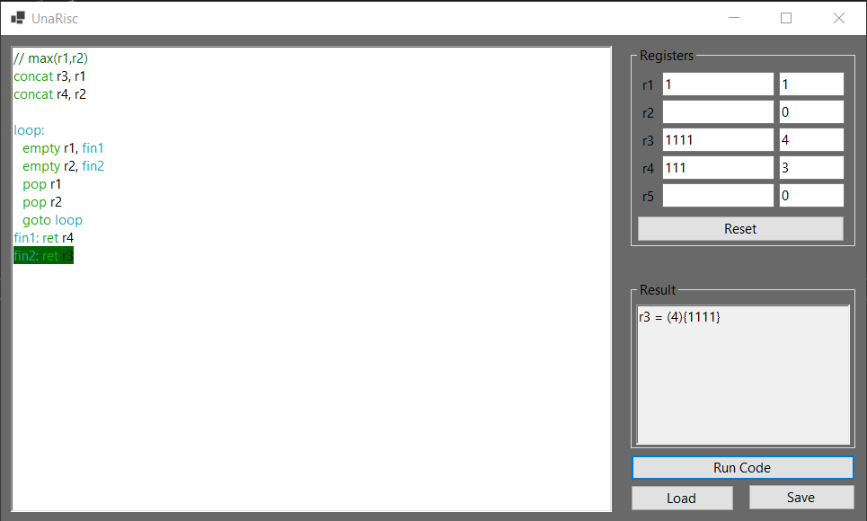

# UnaRisc
An interpreter for the [UNARISC language](https://info.usherbrooke.ca/mblondin/cours/ift209_h23/devoirs/devoir1.pdf)

Supported instructions : 
| Instruction | Description | Example |
| - | - | - |
| `push r[x]` | add 1 to the register | `push r1` |
| `pop r[x]` | remove 1 from the register or do nothing if the value was already 0 | `pop r1` |
| `concat r[x], r[y]` | add the amount in `r[y]` to `r[x]` | `concat r1, r2` |
| `goto [label]` | jump to the label | `goto loop` |
| `empty r[x], [label]` | jump to the label if the register is empty | `empty r1, loop` |
| `ret r[x]` | return the content of the register | `ret r1` |
